## About
Last Updated October 4, 2017  
Created by Sarah Clayton

## Table of Contents
* [Introduction](#introduction)
* [Getting Started](#getting-started)
  * [Downloading OpenRefine](#downloading-openrefine)
  * [Getting the Data](#getting-the-data)
* [Creating a Project](#creating-a-project)
* [The Interface](#the-interface)
* [Data Types](#data-types)
* [Filters and Facets](#filters-and-facets)
  * [Timeline Facet](#timeline-facet)
  * [Number Facet](#number-facet)
  * [Text Facet](#text-facet)
* [Bulk Editing](#bulk-editing)
  * [Clustering](#clustering)
  * [One For All](#one-for-all)
  * [GREL](#grel)
* [Spilting Cells](#spilting-cells)
* [Saving work](#saving-work)
* [Resources](#resources)
  
  

## Introduction
OpenRefine (formerly Google Refine) is an open source software, which can help clean messy data. OpenRefine can't solve all of your messy data dilemmas, but it can make some of the processes quicker and easier. This tutorial will walk you through some of the basics of the tool using real data.  
[Return to Top](#about)

## Getting Started
### Downloading OpenRefine
Before we dive into to the software, we need to get both the tool and the data loaded onto our computer. 

You can download the OpenRefine software from [http://openrefine.org/download.html](http://openrefine.org/download.html). There are Windows, Mac, Linux distrubtions available. 

### Getting the Data
The data will be using comes from the [International Organization on Migration's Missing Migrants Project](https://missingmigrants.iom.int/). According to project's About page: 
> IOM's Missing Migrants Project tracks deaths of migrants, including refugees and asylum-seekers, who have gone missing along mixed migration routes worldwide. The research behind this project began with the October 2013 tragedies, when at least 368 individuals died in two shipwrecks near the Italian island of Lampedusa. Since then, Missing Migrants Project has developed into an important hub and advocacy source of information that media, researchers, and the general public access for the latest information" [https://missingmigrants.iom.int/about](https://missingmigrants.iom.int/about). 

The data is made accesible through a Creative Commons Attribution 4.0 International License. 

You can download the data from the project site for different years, but we are going to download a spreadsheet with all the years combined from The Humanitarian Data Exchange. 

The examples in this tutorial will use a snapshot of this data downloaded on October 4, 2017. [You can download the example data here.]({{page.root}}data/MissingMigrants.xslx) 

If you want to work with the most recent iteration of this data, go to [https://data.humdata.org/dataset/migrant-deaths-by-month](https://data.humdata.org/dataset/migrant-deaths-by-month). Scroll down and download the Migrant Deaths by month excel file.

Open up the data to see what is in it. **What stands out to you that needs to be cleaned?**

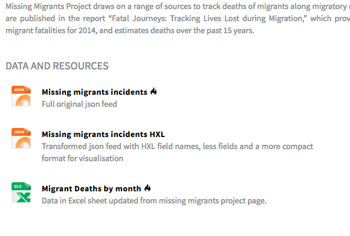

[Return to Top](#about)

## Creating a Project
Open OpenRefine. It should open a browser window. If you look at the address bar at the top it should display 127.0.0.0.1:3333. This indicates that it is running on our local machine. You do not need to be connected to the internet to use OpenRefine. 

To start a new project, select **Create Project** in the upper right corner. Notice that you can choose files from your computer, an URL, your clipboard, or Google Data. We want to choose a file from our computer. Click **Choose Files**, and select the MissingMigrants.xlsx file. Click **Next**.

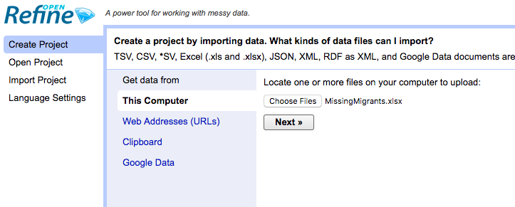

The next screen displays a preview of your data. Typically, OpenRefine does a pretty good job of parsing the data, but it is worthwhile toto look at the options at the bottom of the screen that are available if you need to change the parsing settings. For example, OpenRefine might try to read in comma deliminated files as tab deliminated. In that case, you would need to adjust the settings to force the system to parse by commas. 

You probably want to change the name of your project using the text box in the upper right corner. If you don't change it, the project will have the same name as the original file including the file extensions. I will go and remove the xlsx part from the title. 

Once you are ready, click **Create Project** in the upper right next to the title.

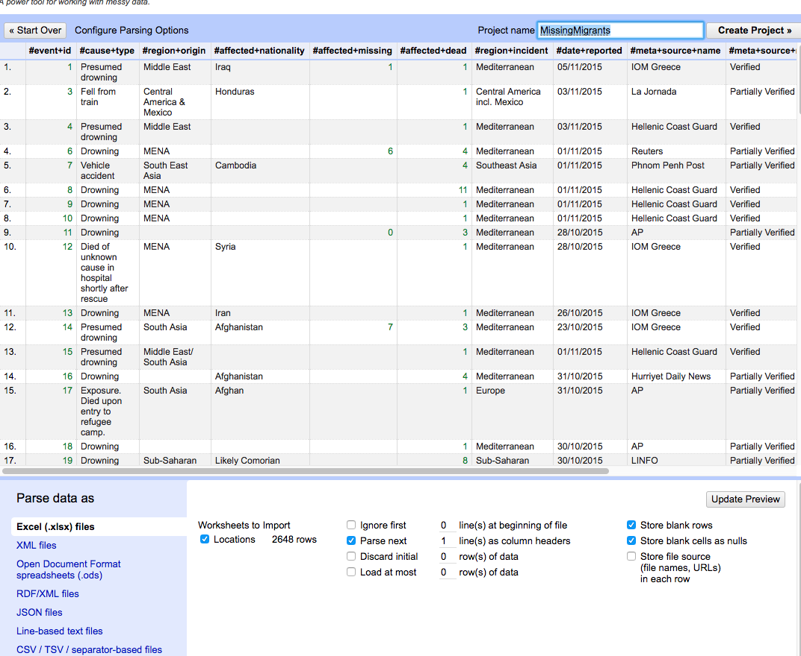

[Return to Top](#about)

## The Interface
Let's take a few minutes to look at the interface. The OpenRefine window is divided into two sections separated by a light blue line. The smaller section on the left is for faceting and filtering. At the top of the section, there is a Undo/Redo tab. In addition to letting us undo/redo actions, this tab will also let export a list of changes so we can repeat them later. 
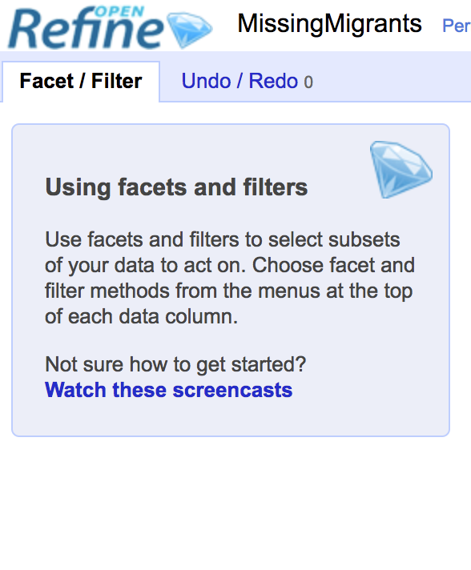

In the larger section, our data is displayed in a spreadsheet format. At the top, you should see that you have 2647 rows. Right below you can switch between rows and records. We will go into more details on this in the spilting cells section. You can also change to display to show up to 50 rows on the page. Go ahead and select 50 rows so we can see as much of our data as possible at once. 

Hovering over a column header will reveal a down arrow. Clicking on this arrow will reveal the different editing options. We will explore the functionality of some but not all of these during this tutorial. 

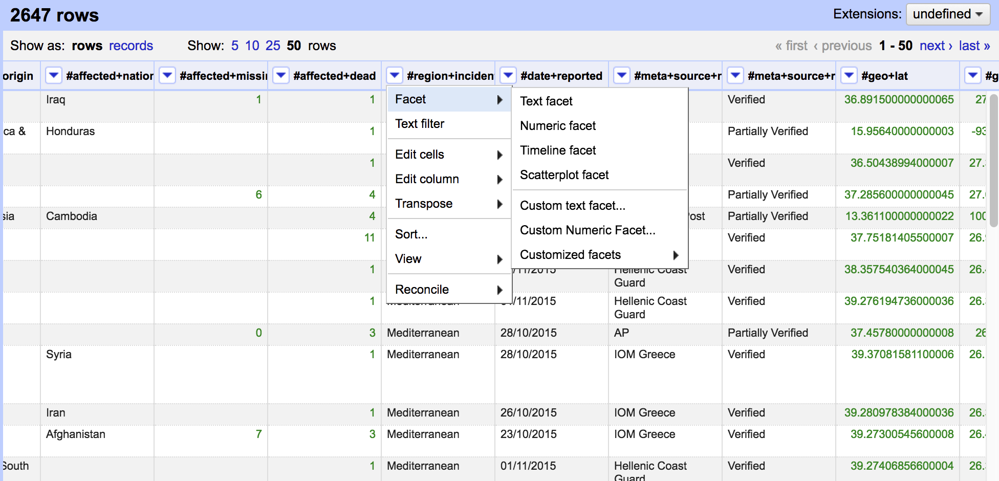

Before we move on, I want to point out 3 buttons on the very top right corner of the screen. They are Open, Export, Help. **Open** will allow you to open another project in OpenRefine. **Export** will allow you to download your file in its current state in a variety of formats. **Help** will take you to the official OpenRefine documentation. 

[Return to Top](#about)

## Data Types
Data in OpenRefine is auto-sorted into one of three data types: text, numbers, or date. There are subtle color differences to indicate the different types - apologies to all the color-blind users. Looking at your table, you should see 4 columns with data in green. The #affected+missing, the #affected+dead, #geo+lat, and #geo+long. 

Since each data types has some slightly different functionality, you may want to change the data type. As an example, we can change #date+reported to the date format. 

Click the down arrow by #date+reported. Scroll to **Edit cells**. Select **Common transformations**. Finally, select **To date**. 

*Notice all the different options in common transformatons including trimming whitespace, changing capitalization, and switching the data type. These can help you quickly make your data more useable.*

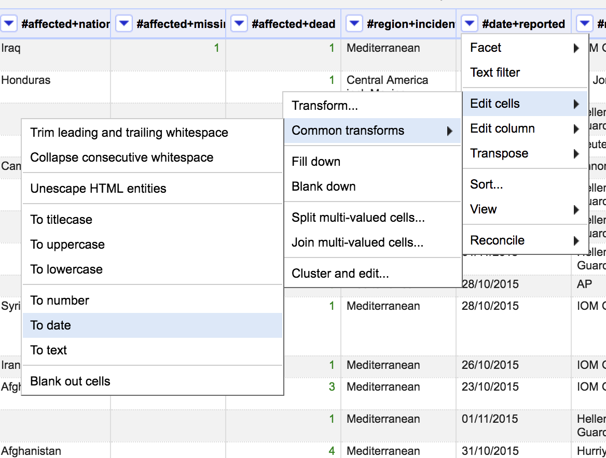

Now,the data in the date field is also green. A timestamp was also added, which doesn't really make sense for our data. However, it won't affect our analysis so we will just leave it as for now. We will want to change it back to a text before exporting it. 

[Return to Top](#about)

## Filters and Facets
### Timeline Facet
We can use tools in OpenRefine to help us quickly better understand our data. OpenRefine has a several ways to facet our data, which can give help us identify potenital problems. Let's start with the #date+reported column we have just transformed. 

Click the down arrow next to #date+reported column scroll over **Facet** and select **Timeline facet**.

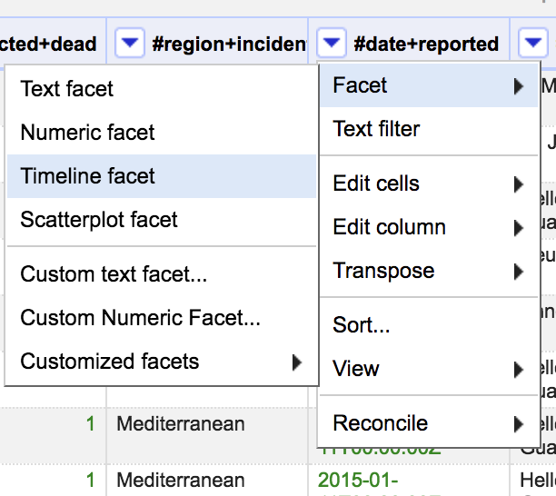

After you have selected this, you should see a new box open in the Facet/Filter section on the left side of the string. 

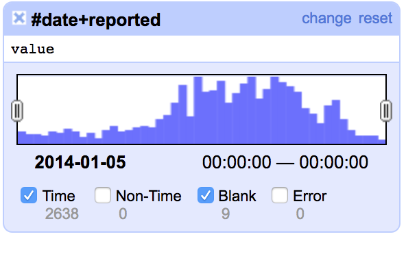

Uncheck the box at the bottom of the facet that says Blanks. This will filter out all of the rows with no date so they are not displayed in our data. 

You can use the facet to adjust the data based on the date reported. On the left side of the box, there is a gray oval with two lines. Drag the oval until the date displayed at the bottom is in 2016. After you do this, look at the number of matching rows at the top of the spreadsheet. This number should have decreased. 

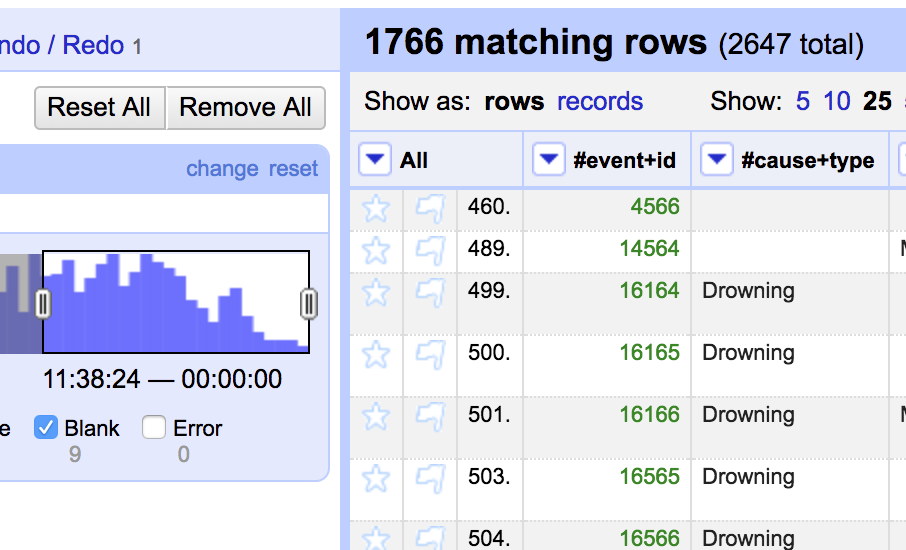

### Number Facet
We can also facet by our numeric data values. Let's try it with the #affected-missing column. Select the down arrow, **Facet**, and then **Numeric facet**. 

Once again eliminate the blank entries. Notice how drastically the number of rows declines. You can use the gray oval to further filter the data. Let's change it to only show incidents that had over 100 missing persons. Now, you should only have a handful of records. 

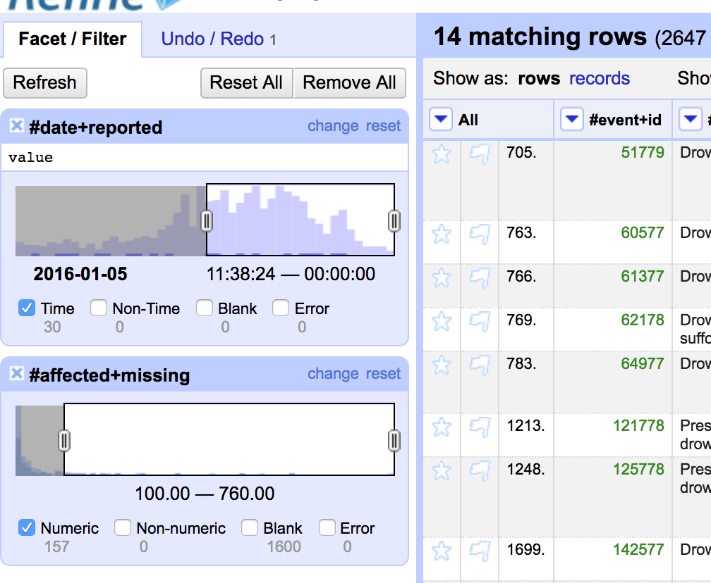

**What similarities do these records have?** 

**How could filters like this be valuable to humanitarian workers and/or journalists?**

### Text Facet
Notice that as we add additional facets, the previous ones remain in the facet/filter section. Let's remove our numeric and timeline facets before adding a text facet. To remove a facet, click the x in the top left corner of each individual facet. Do this for both of your current facets. 

The IOM Missing Migrants Project data is collected from a variety of sources. Let's facet by text on those sources to see which ones provide the most data. Find the #meta+source+name column (you will need to scroll over in your spreadsheet). Click the arrow, scroll over **Facet**, and select **Text facet**. 

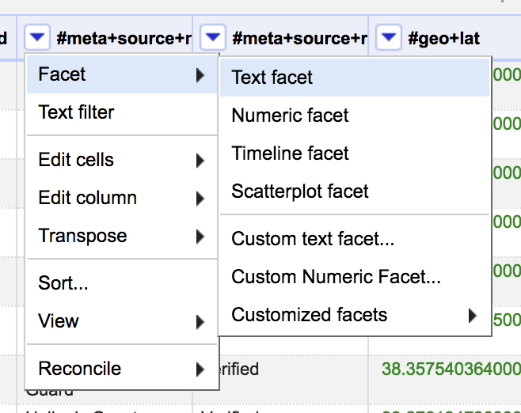

Look at the text facet that has appeared in the facet/filter section. There are currently 659 distinct values in this column. If you scroll through the list you will see some values that are very similar. See the screenshot below for an example. We will solve this problem in the next section. 

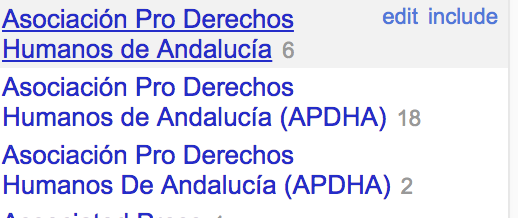

At the top of the facet, notice that you can sort the entries by name and count. Select **Count** to see the most frequent sources. 

[Return to Top](#about)

## Bulk Editing
OpenRefine offers serveral different methods to bulk edit your data. In this section, we will go through some of these functionalities.
### Clustering
Clustering is one of the most efficient ways to clean you data. In the text facet window you have open, click the **Cluster** button at the top. 

A new dialog box will open. In the center of the box, OpenRefine will suggest values that might be the same. 

To designate the values you would like to consolidate, check the merge box. You can go with the suggestions for the new cell value given by OpenRefine or you can choose your own by typing it into the New Cell Value Box. You can also use one of the values being merged as the new cell value by clicking on it. 

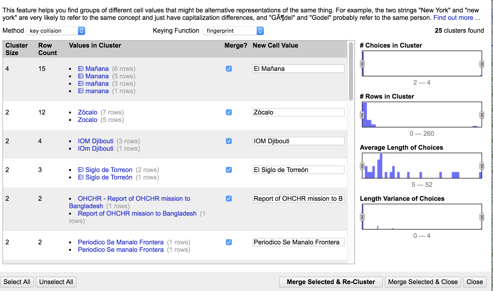

Work down the page and merge any values you think are the same. When you are done, click Merge Selected and Re-Cluster. 

After you merge and re-cluster. Look at the top of the box, and you should see two downdown boxes - **Methods** and **Keying Function**. These run different clustering algorithms. Changing these will give you different potential matches. Try out some different options to see what clusters you would like to merge. All of the suggestions may not be valid so use your judgement. 

**What algorithms seem to work best for this data? Which are the least effective?**

After you are finished merging the cluster you think should be combined. Exit the cluster dialog box. 

After I finished clustering, there are 616 distinct values (remember it 659 before we clustered). Your number may differ based on merging decisions you made. 

Let's repeat the process for another column. First, remove the text facet you have on #meta+source+name. Add a text facet to #cause+type. 

Sort by count. Note that they are currently 300 distinct values. 

Click **Cluster**. Cluster as many same results as you see. Be careful. There are often multiple causes in a single record. The different values are sometimes separated by a comma, and sometimes they are not. We want them to be separated by a comma, so select that option or type it into the text box when possible. When you are done, click **Merge Selected & Re-Cluster**. 

After my clustering, I have 275 distinct values. Again, yours may be slightly different based on your clustering decisions. 

### One for All
When you look at your top facets by count on #cause+type, you should see and entry similar to "Sickness_and_lack_of_access_to_medicines." Let's remove those _'s. We will do this three different ways to demo some of the potential of OpenRefine. 

First, hover over the Sickness_and_lack_of_access_to_medicines in the facet box and click the **edit** button that appears. 

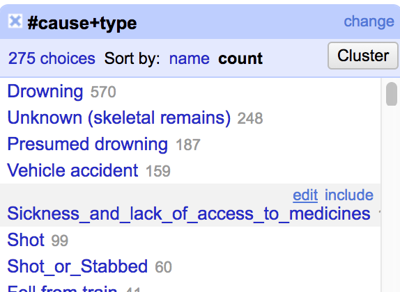

In the text box that appears, remove the _'s in the text. Click **Apply**. 

The yellow box that appears at the top of of the screen indicates that we just edited 120 cells. If we look at the undo/redo tab we can also see that we performed a mass edit on 120 cells. 

Let's look at another way to edit once for a group of cells. Scroll down until you see Sickness_and_and_lack_of_access_to_medicines, Starvation, which should should have 33 matches. This time click on it. This will alter the spreadsheet display to show only these records. 

Now hover over the one of the cells with the data in the spreadsheet. Click the blue **edit** button that appears.

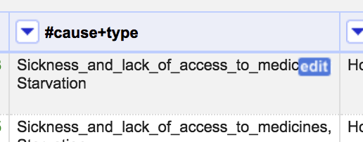

In the text box that appears, delete all of the _'s. Then click **Apply to All Identical Cells**. 

After you do that, all of the cells should disappear from the spreadsheet because you have a filter set to match Sickness_and_and_lack_of_access_to_medicines, Starvation. To see all of the values, select another filter by clicking on a value in the facet box. Then, unclick the filter you just selected to get back to the unfiltered view. 

### GREL
The above methods worked pretty well and allowed us to edit 120 and 33 cells at once. But if you scroll down and look at the other causes you should notice that a significant number of the 1 count values have underscores. 

Luckily, we can use a special syntax called Google Refine Expression Language (GREL) to match patterns and make bulk changes. 

First, go the #cause+type column's menu. Click **Edit cells** and select **Transform**.

In the expression field enter: **replace(value, "_", " ")**. It is very important that there is a space between the second sets of quotes. Basically this expression (or recipe as they are sometimes called) looks in each value, finds every _ and replaces it with a space. Once you have entered the expression, click **OK**. 

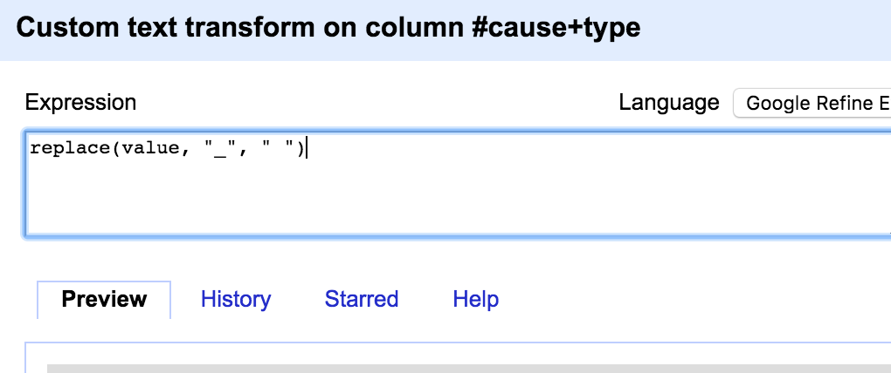

Now, look through your data to confirm that the expression worked. 

GREL is very powerful but can take time to become comfortable with it. However, you can often find someone online who has run a similar transformation and has made their expression available. You can also look up all of the GREL functions and how to use them in the OpenRefine Github Repository: [https://github.com/OpenRefine/OpenRefine/wiki/GREL-String-Functions](https://github.com/OpenRefine/OpenRefine/wiki/GREL-String-Functions). 

## Spilting Cells 
Now, the the underscores are removed, we can move onto another data problem; there are often multiple causes within a cell, which can make it challenging to see which causes come up the most often. 

Since we have been trying to separate different causes with a commas, we can use that to separate all the values. 

Go into the #cause+type menu. Click on **Edit Cells** and select **Split multi-valued cells**. 

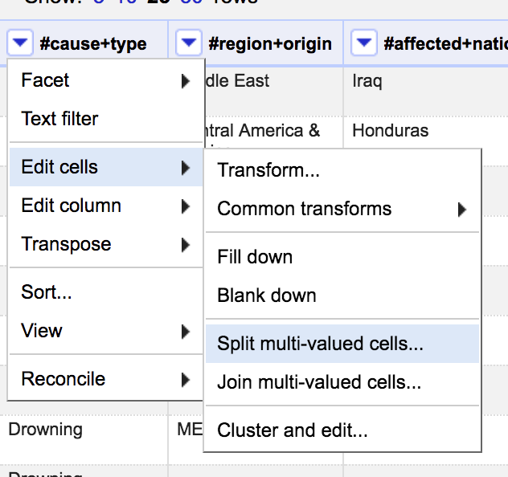

In the pop-up that appears, leave the default comma that appears, and click **OK**. 

Notice that your total number of rows has increased to 2842. However, if you click to show records instead of rows (right below the number of rows), you should see that the number of records has remained consistant. 

Each value is associated with the the record but is displayed on a separate row. Depending on your next step and how you are going to export your data, this may or may not work for your final dataset. Look at record 96 to see an example of this.

For now, let's run another cluster analysis on the #cause+type data to see if the spilt cells have made a difference. 

During this process, you might see a number of cells where values were not split by commas (likely using the metaphone3 keying function). You might want to go through and manually change some of these values using the techniques discussed in the One for All section. After you have done this, spilt the cells again by comma, and try to cluster again. 

When you cluster, you will probably notice that you still have multi-values groups. While in the cluster box hover over the bottom of a grouping and you should see a browser this cluster button. This will open a new tab with only these items filtered. This will help you focus on the records that still need to be change. 

*Note: I noticed that the browse this cluster fuction did not seem to work if the cluster was too large.* 

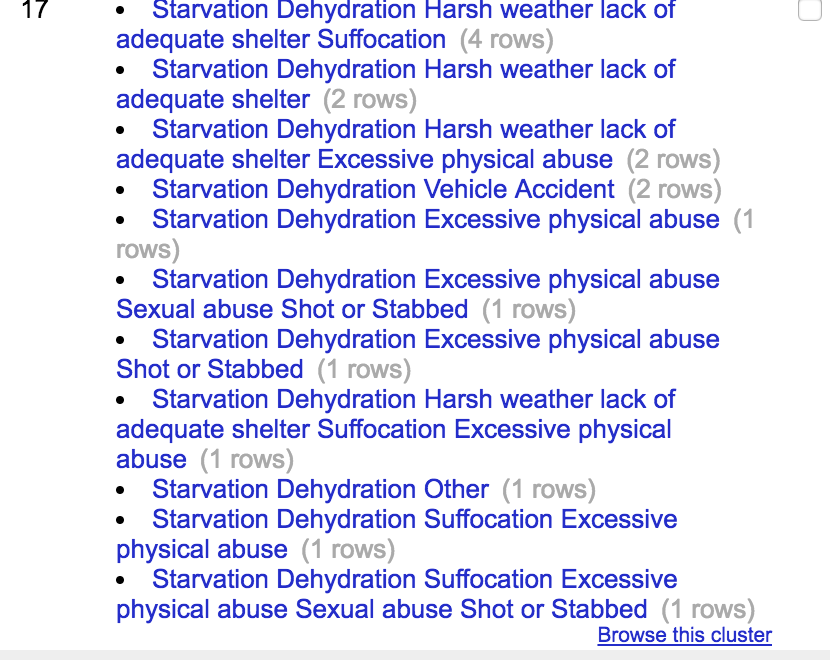

This example is important because it demonstates that sometimes you won't be able to do large bulk edits to fix every data problem. However, OpenRefine can make the process faster than if you were doing the whole data cleaning process manually. 

Go through this exercise of spliting and clustering as many times as you would like to feel comfortable, noting how many distinct values are present in the #cause+type facet. In my example, I did not fully clean the data (there are many multi-value fields still present), but I was able to reduce the total number of distinct values down from 300 to 225. 

If we want, we can rejoin the cells confident that the individual causes are formated the same. Go to the #cause+type menu, click **Edit cells**, and select **Join multi-valued cells**. In the pop up box that appears, you can select how to separate the values. I typically leave the default comma. 
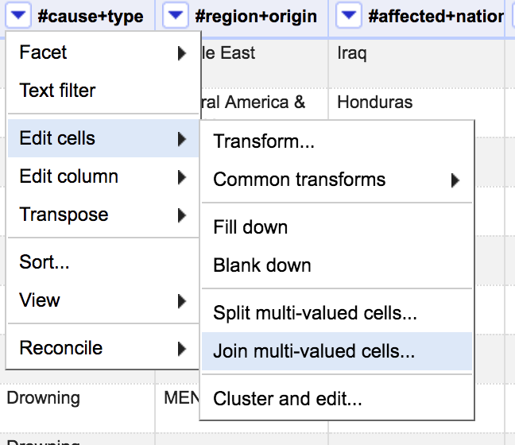

## Saving Work
Now that your data is clean, you probably want to you use it in another application. To do this, click **Export** in the top right. This will give you a variety of different options. 

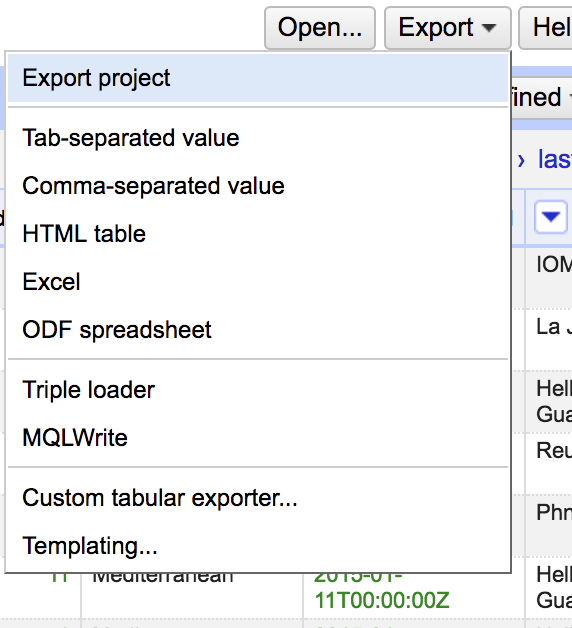

If you select **Export project**, it will save the whole OpenRefine project, which might be nice if you are trying to share the data cleaning work you did with a colleague or use it on another computer. 

Other popular options are comma-separated values, and excel files. Select whichever options makes sense for your project, and the file will automatically download. 

Your OpenRefine project is automatically saved in your OpenRefine application. If you click the OpenRefine logo in the top right corner, you will be taken to a list of your projects. 

Click on your project's title to open it. 

Before the conclusion of this tutorial, I want to point out one more important element in OpenRefine. Click the **Undo/Redo** tab on the top of the Facet/Filter section. This lists every command we have run in this OpenRefine Project. Clicking any of the steps will revert the project back to that stage. 

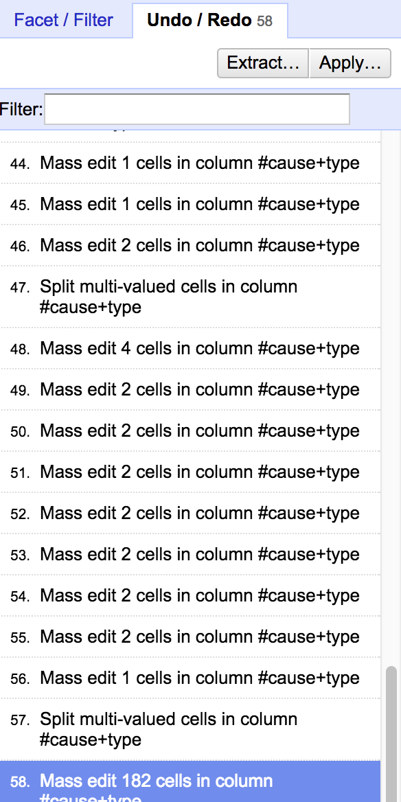

Also note the **Extract** and **Apply** buttons on the top. Extract will let you pull out all of OpenRefine actions as JSON. Apply will let you run the actions (that you extracted from another OpenRefine project) on the project. 

## Resources
Hopefully, this tutorial helped you become familiar with some of OpenRefine's functionality, but there is a lot more to explore. 

OpenRefine maintians a list of tutorials - including beginning and more advanced or specific topics. You can find these tutorials at [https://github.com/OpenRefine/OpenRefine/wiki/External-Resources](https://github.com/OpenRefine/OpenRefine/wiki/External-Resources). 
